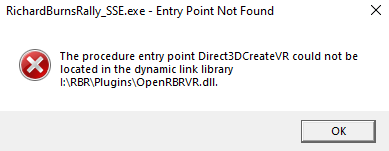
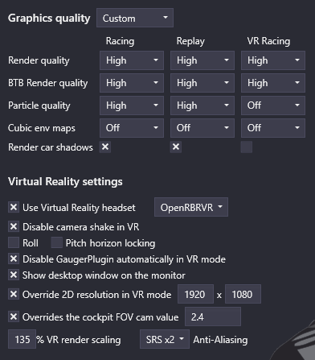

# FAQ

[🇬🇧](FAQ.md) - [🇨🇿](FAQ_CZ.md) - [🇫🇷](FAQ_FR.md)

## Le plugin ne démarre pas

### Il manque Direct3DCreateVR

Le fichier `d3d9.dll` ne provient pas des releases de openRBRVR. Le launcher RSF fait parfois de mauvaises installations, essayer les étapes ci-dessous pour résoudre le problème :

- Fermer RBR
- Changer avec le plugin RBRVR et revenir sur le plugin openRBRVR (si les deux sont installés).

Si cela ne fonctionne pas, essayer les étapes suivantes :

- Fermer RBR
- Désactiver le mode VR dans le launcher RSF et s'assurer que le paramètre 2D plein écran est sur "Normal" et non sur "Vulkan".
- Fermer le launcher RSF et relancer le dernier Rallysimfans\_Installer.exe. Choisir "Update Existing Installation" (s'assurer que RBRVR et openRBRVR soient cochés dans la liste).

### Le jeu crash et se ferme

- S'assurer que le plugin Light n'est pas activé. Le mode n'est pas compatible avec RBRRV.
- SI openXR est utilisé, s'assurer que le casque le supporte.

## Est-que je peux utiliser OpenXR à la place de OpenVR/SteamVR ?

OpenXR est supporté par les casques qui on 32-bit OpenXR runtime disponible. Voir le tableau ci-dessous pour vérifier que votre casque est compatible :

| Fabriquant   | Runtime                                                                   | Support     | Comments                                                                    |
| ------------ | ------------------------------------------------------------------------- | ----------- | --------------------------------------------------------------------------- |
| Pimax        | [Pimax-OpenXR](https://github.com/mbucchia/Pimax-OpenXR)                  | ✅          |                                                                             |
| Oculus       | Oculus OpenXR / [VDXR](https://github.com/mbucchia/VirtualDesktop-OpenXR) | ✅          |                                                                             |
| Pico         | [VDXR](https://github.com/mbucchia/VirtualDesktop-OpenXR)                 | ✅          |                                                                             |
| Reverb       | WMR avec [OpenXR-Vk-D3D12](https://github.com/mbucchia/OpenXR-Vk-D3D12)   | ✅*         | A besoin de contourner la synchronisation qui peut potentiellement avoir un impact sur les performances  |
| Valve        | SteamVR OpenXR                                                            | ⛔          | 32-bit runtime non disponible                                               |
| Varjo        | Varjo OpenXR                                                              | ⛔          | 32-bit runtime non disponible                                               |

Activer OpenXR runtime depuis `Options -> Plugins -> openRBRVR -> VR runtime`
ou éditer `openRBRVR.toml` pour avoir `runtime = 'openxr'`. Pour les casques
Reverbs, sélectionner `OpenXR (Reverb compatibility mode)` depuis le jeu ou
mettre `runtime = 'openxr-wmr'` dans le toml.

## Mes FPS sont pire que dans RBRVR

- Désactiver l'environnement cubique
- S'assurer que l'anti-aliasing n'est pas trop élevé. Généralement 4x SRS est le maximum acceptable, sachant que la majorité des configurations ne peuvent pas aller au-delà de 2x SRS.

## Comment je réinitialise la vue en VR ?

- Assigner une touche via `Options -> Plugins -> RBR Controls -> Page 2 -> Reset VR view`

## Comment je déplace mon siège ?

- Activer la pause avant le décompte 3-2-1 dans la page `Controls` du launcher RSF pour avoir le temps d'ajuster la position du siège avant le début de la spéciale.
- Ouvrir RBR et aller dans stage.
- Ouvrir le plugin PaceNote avec un double clic droit de la souris sur la fenêtre RBR. Déplacer le siège, cliquer sur sauvegarder et fermer la page avec le `X` dans le coin haut droit.

## Comment j'acive le filtre anisotropic ?

Le launcher RSF ne montre pas l'option pour modifier le filtre anisotropic. Il peut être changé  en modifiant `dxvk.conf` manuellement :

- `d3d9.samplerAnisotropy` Utiliser 0, 2, 4, 8 ou 16.

## Il manque les textes dans les menus RBR

- Augmenter la résolution du 2D en mettant 800x600 ou au-dessus.

## Le jeu est toujours affiché sur un "écran" sans l'environnement VR

- C'est normal dans les menus. Si ça arrive également lors de la conduite dans une spéciale, il faut installer SteamVR.

## Quels paramètres graphiques je devrais utiliser ?

- Cela dépend de la configuration. J'utilise SteamVR avec une échelle à 100%, un filtre anisotropic à 16x avec les paramètres suivants dans le launcher RSF :

## Il y a des scintillement et/ou des vacillements avec certaines textures

- Cela peut arriver si il n'y a pas d'Anti-Aliasing et/ou de filtre anisotropic. Essayer d'augmenter le filtre anisotropic et l'Anti-Aliasing si votre configuration le permet.
