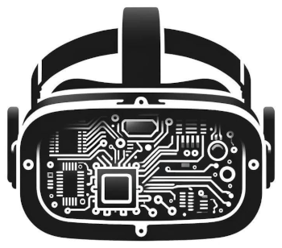

# openRBRVR

[🇬🇧](README.md) - [🇨🇿](README_CZ.md) - [🇫🇷](README_FR.md)

Open source VR plugin for Richard Burns Rally.

## Features

- Performance overall seems better compared to RBRVR. On some stages the
  difference is huge, on others they're quite similar.
- The image is more clear with openRBRVR with same resolution compared to
  RBRVR.
- Vulkan backend via dxvk ([fork](https://github.com/TheIronWolfModding/dxvk)
  originally by TheIronWolf that adds D3D9 VR support).
- PaceNote plugin UI works correctly.
- Gaugerplugin works correctly (but has a performance impact).

## Installation instructions

This plugin can be installed with the official [RSF](https://rallysimfans.hu)
installer.

To install a more recent version than what is available in the RSF installer,
download the latest release and copy&paste all files into RBR folder,
overwriting existing files when asked to. Make sure that the RSF launcher has
Virtual Reality and openRBRVR enabled when manually installing new versions of
the plugin.

## Setup

Plugin settings can be changed from `Options -> Plugins -> openRBRVR` and saved
to `Plugins/openRBRVR.toml` via the menu.

With the desktop FoV, objects might disappear from your peripheral vision
before they go out of frame. On some stages this is more apparent than others.
This can be fixed either from the RSF launcher, NGPCarMenu, or runtime by using
the PaceNote plugin (double click right mouse button to open up the menu).
Values between 2.3-2.6 work fine for my wide FoV headset.

## Frequently asked questions

- See the [FAQ](https://github.com/Detegr/openRBRVR/blob/master/FAQ.md).

## Known bugs and limitations

- The seat position cannot be changed via keyboard. PaceNote plugin can and
  should be used instead. The UI works as expected.
- BTB stages can have a really poor performance if cubic env maps are enabled.
  I suggest disabling them for openRBRVR.

## Build instructions (for developers only)

The project uses CMake. I've been developing it with Visual Studio 2022
community edition that has CMake support built in.

To build d3d9.dll, build `dxvk` using meson. I used `meson setup
--backend=vs2022 --build_type=release` to configure it.

## Thanks

- [Kegetys](https://www.kegetys.fi/) for RBRVR, showing that this is possible.
- [TheIronWolf](https://github.com/TheIronWolfModding) for patching VR support
  for D3D9 into dxvk.
- Towerbrah for the idea to implement VR support using TheIronWolf's fork and
  the help debugging RBRHUD+RBRRX issues.
- [mika-n](https://github.com/mika-n) for open sourcing
  [NGPCarMenu](https://github.com/mika-n/NGPCarMenu) and collaborating to make
  RSF and RBRControls work with the plugin.

## License

Licensed under Mozilla Public License 2.0 (MPL-2.0). Source code for all
derived work must be disclosed.
